# Rayker-Game
a souls like game with multiplayer 
====================================================
              SURVIVAL GAME
Open World • Multiplayer • RPG • Survival
====================================================

A multiplayer open-world Souls-like survival RPG built in Unity 6 using Netcode for GameObjects and Unity Gaming Services.

The project emphasizes scalable multiplayer architecture, persistent online characters, modular systems, patch distribution, and long-term maintainability rather than serving as a simple gameplay prototype.

---

## Gameplay

- Multiplayer survival experience
- Character creation and customization
- Open-world exploration
- Souls-like melee combat
- Boss encounters
- Inventory and equipment system
- Character progression
- Friend system
- Player invitations
- Revive system
- Health regeneration
- Persistent player saves

---

## Technical Features

### Multiplayer

- Netcode for GameObjects
- Client prediction where applicable
- Lobby system
- Player synchronization
- NetworkVariables
- RPC architecture
- Ownership handling
- Host and dedicated-server ready architecture

### Character System

- Character creation
- Character selection
- Avatar importing
- Persistent character saves
- World-specific character data

### Friend System

- Add and remove friends
- Send and receive friend requests
- Real-time online status
- Join friends' worlds
- Lobby invitations
- In-game friend list
- Unity Gaming Services Friends integration
  
### Save System

- Character serialization
- World persistence
- Account management
- Multiple save slots

### UI

- Dynamic menu system
- Navigation controller
- Controller and keyboard support
- Responsive multiplayer UI

### Launcher

Custom launcher written in WPF featuring:

- Automatic game updates
- Differential patch downloading
- Resume downloads
- Download speed
- Remaining time
- Archive extraction
- Version validation

### Asset Management

- AssetBundle support
- Runtime content updates
- Dependency management

### Performance

- Optimized rendering
- URP
- Asset optimization
- Memory optimization
- Efficient multiplayer synchronization

---

## Technologies

- Unity 6
- C#
- Netcode for GameObjects
- Unity Gaming Services
- Addressables
- AssetBundles
- WPF (.NET)
- Google Drive API
- Git

---

## Project Architecture

The project follows a modular architecture separating gameplay, networking, UI, saving, launcher, and content systems to simplify maintenance and future expansion.

---

# Gallery

## Main Menu

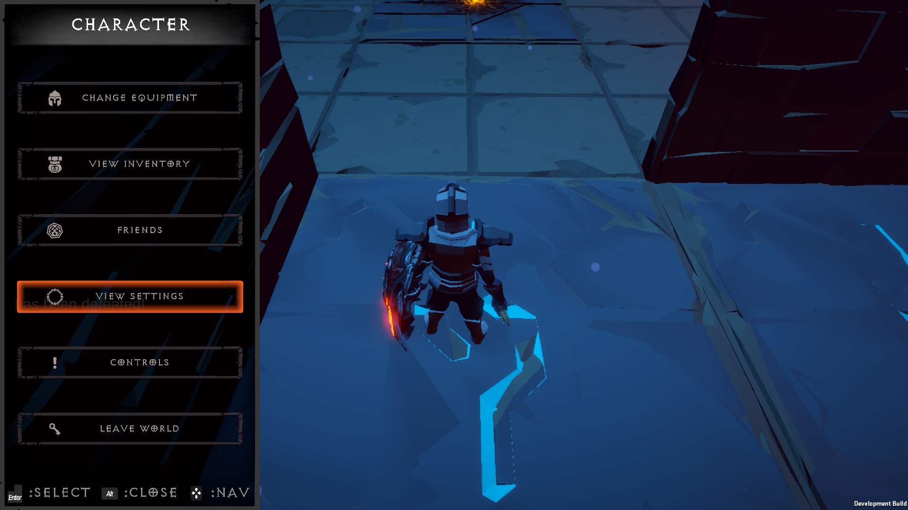

---

## Character Creation

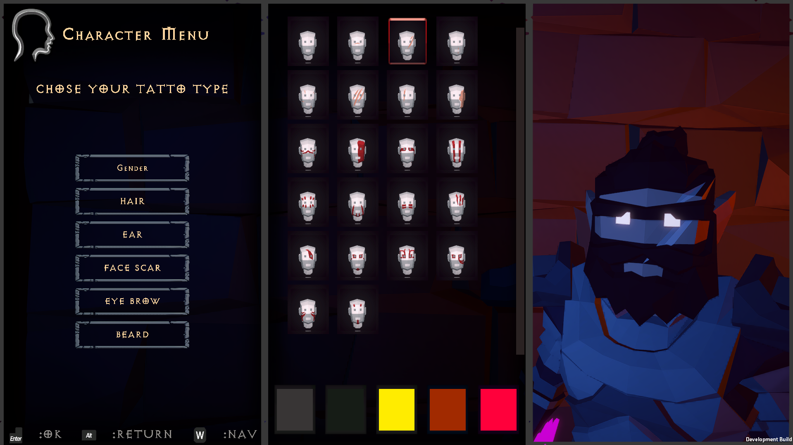

---

## Friend System

Manage your friends, send invitations, and join multiplayer sessions.

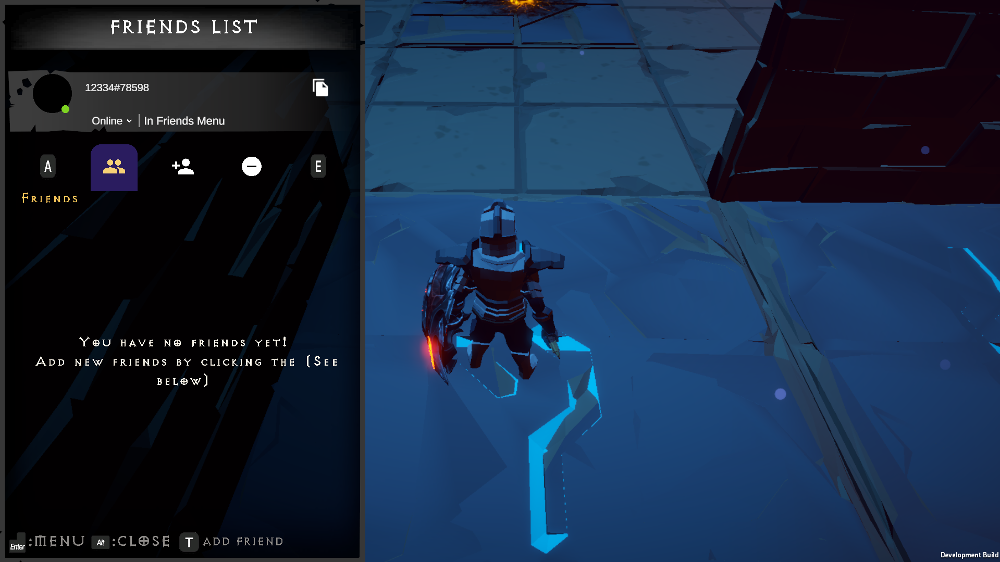

### Friendly Player

Players in your world are clearly identified with a friendly indicator, making cooperative gameplay easier.

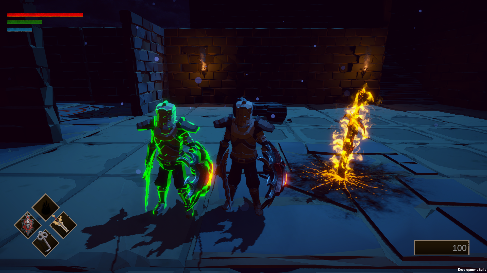

### Invader

Enemy players invading your world are visually distinguished from friendly players to provide immediate gameplay feedback.

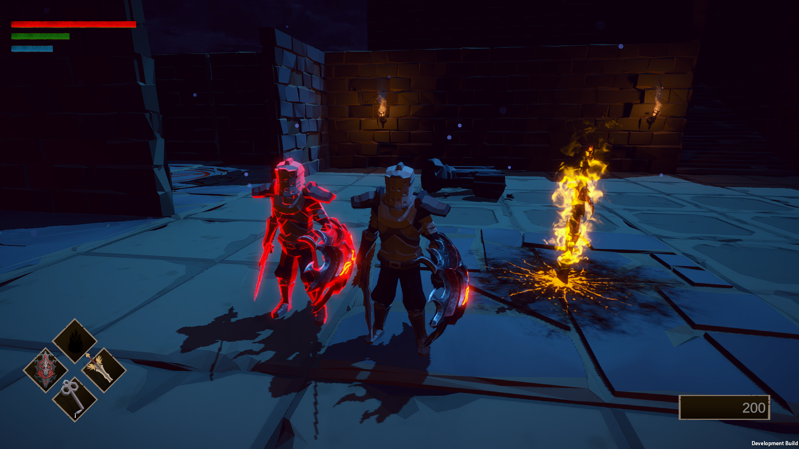

---

## Loading World

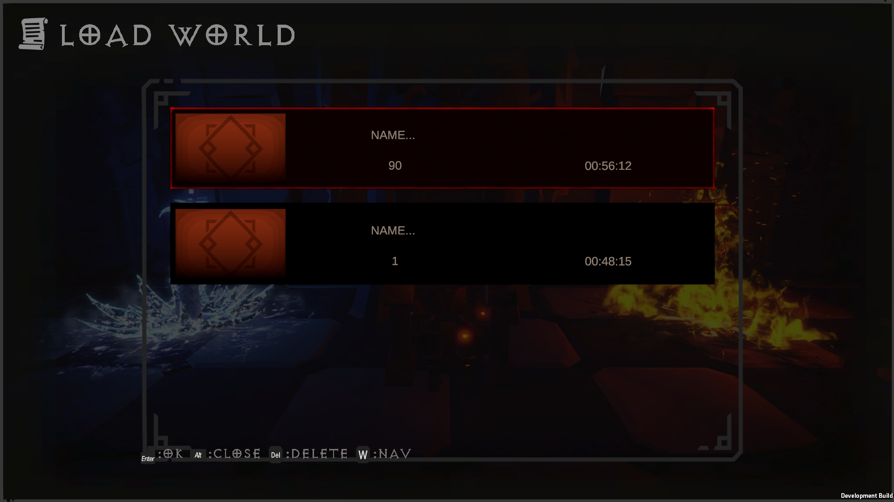

---

# Gameplay

## Open World

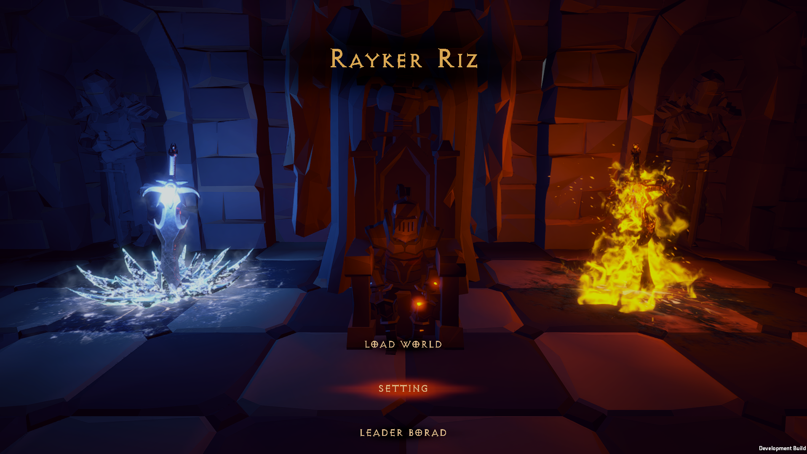

---

## Site of Grace

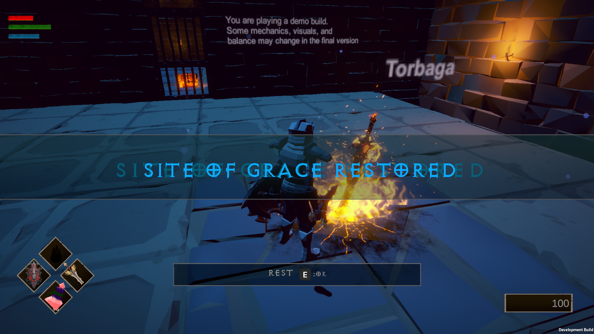

---

## Equipment Menu

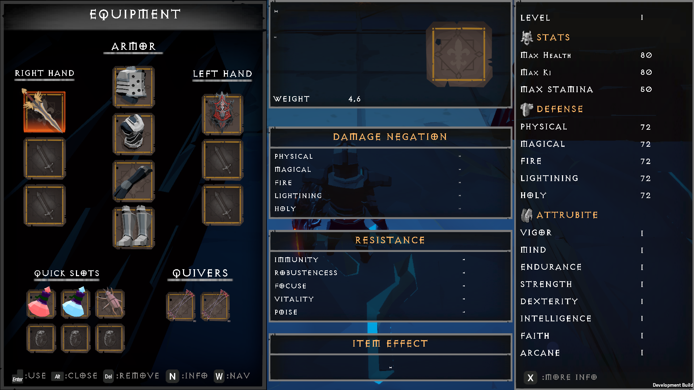

---

## Tooltip Menu

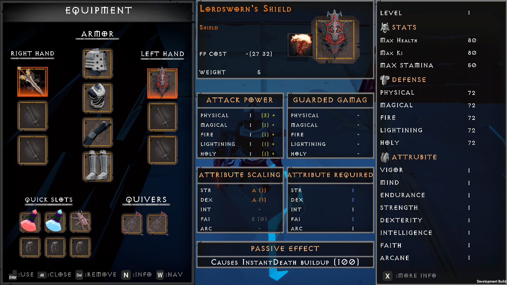

---

## Heal Potion

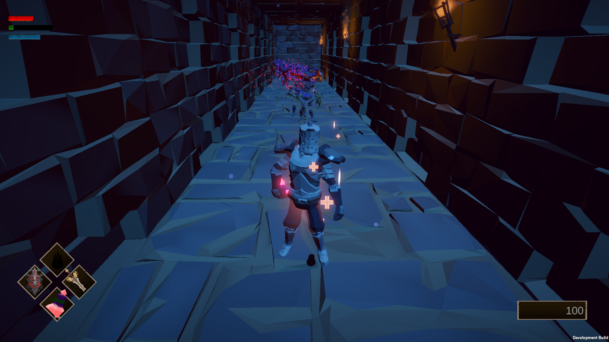

---

## Weapon Skill 1

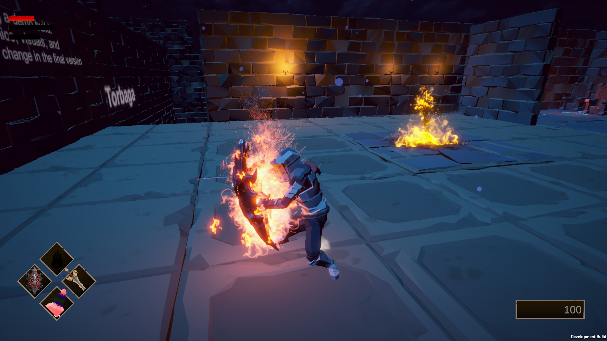

---

## Weapon Skill 2

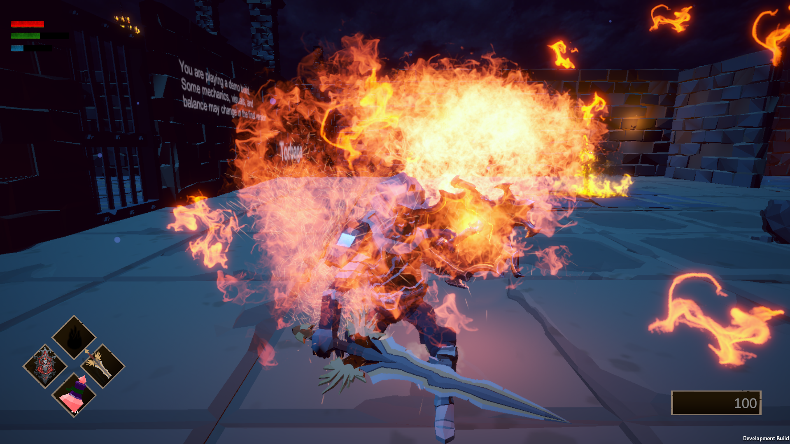

---

# Boss Encounter

## Boss Fight

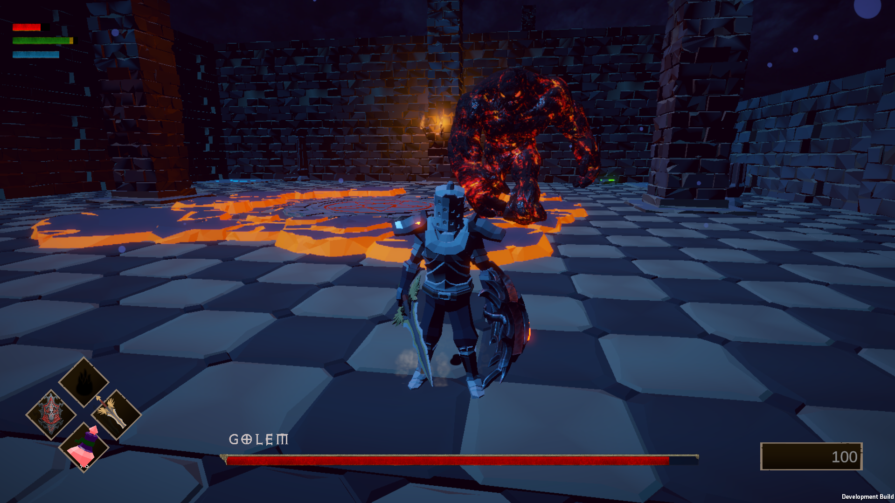

---

## Boss Fight Entrance

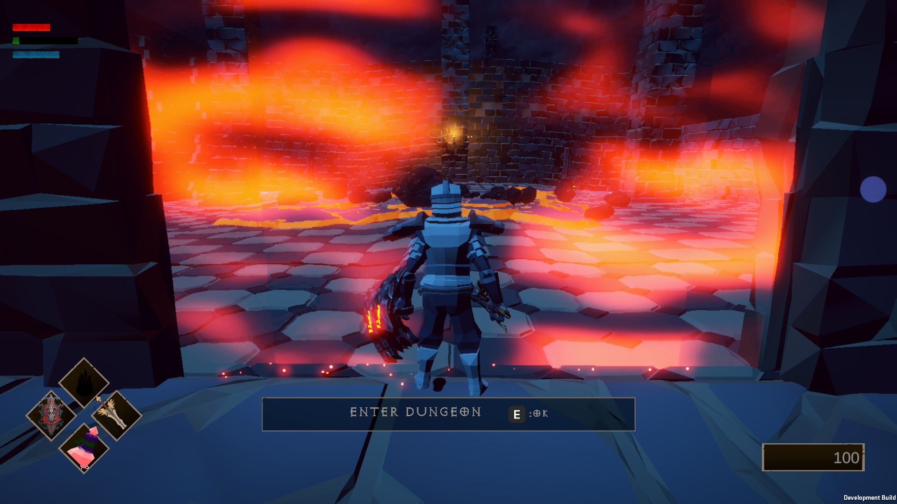

---

## Boss Fight Cinematic 1

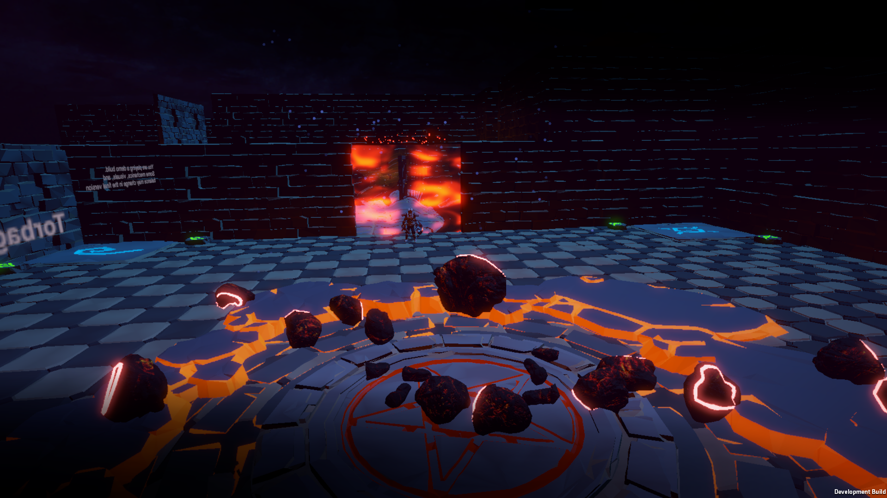

---

## Boss Fight Cinematic 2

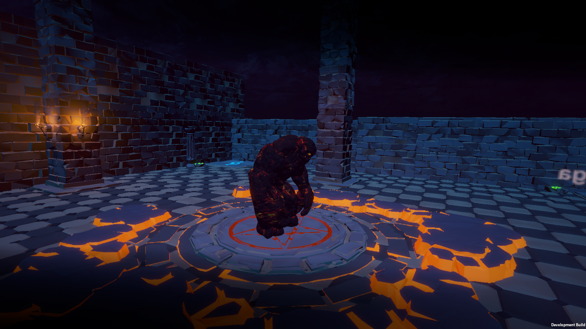

## Gameplay Video

  

---

## Future Plans

- Dedicated servers
- Steam integration
- More biomes
- Crafting expansion
- Quest system
- Additional bosses
